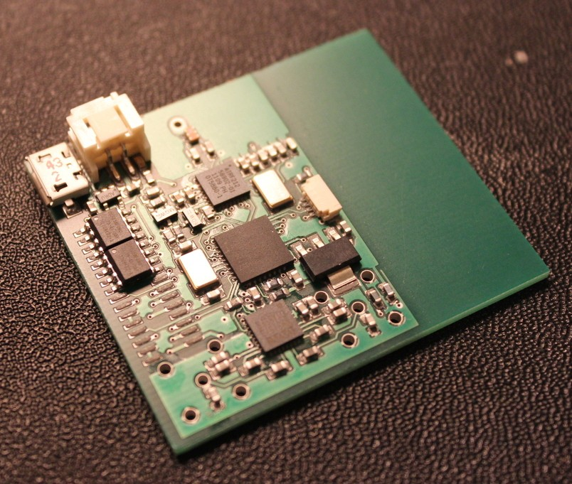

EAGLE CAD Design files for the VLF Remote Unit

## Photo

## Design Notes

The board is based around a NXP
[LPC1114](http://www.nxp.com/documents/data_sheet/LPC111X.pdf) ARM
Cortex-M0 microcontroller. A Wolfson
[WM8737 ADC](http://www.wolfsonmicro.com/documents/uploads/data_sheets/en/WM8737.pdf)
is used to record the Very Low Frequency (VLF) signals. Although this
ADC is intended for audio applications it is perfectly adequate for
very low frequency RF signal due to its high gain preamplifiers. It
features low power operation and easily available, probably due to it
being
[used in the Microsoft Kinect](http://techon.nikkeibp.co.jp/english/NEWS_EN/20101205/187927/).

The board has three pads for serial flash and a
[AT86RF212](http://www.atmel.com/images/doc8168.pdf) 868MHz radio. The
range is in the order of 200m in free space, but much lower in practice.

The average current draw is approximately 3mA.

## [License](LICENSE.md)

[MIT](http://opensource.org/licenses/MIT)
